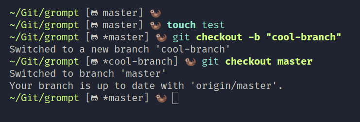

# Grompt
A very simple git status prompt.
Simply call `grompt` to list the git status of the current repo.


Example using `grompt -S -i` in my nushell prompt:



(Note: the default icons use NerdFonts (FiraCode Nerd Fonts in the example), if you prefer to use something else (emojis or text for example), you can simply override them using `-o`! Other icons, such as fetch reminders etc, have dedicated flags as well!)

## Future work
* Add the option to color more than the icon

## Options
The normal way of using `grompt` is by simply calling it, and then supplying options to customize it.
Alternatively it can be customized by creating a config file (`~/.config/grompt/config.toml`). 
If a config file is used, command line options are ignored [subject to change]. 

The default config looks something like this: 
```
parentheses = false
square_brackets = true
unstaged_string = "*"
staged_string = "+"
separate_changes = true
remote_icon = true
print_error = false
icon_override = [
        "https://github.com|\ue708",
        "git@github.com|\ue708",
        "https://gitlab.com|\uf296 |252,109,38",
        "git@gitlab.com|\uf296 |252,109,38"
    ]
icon_color = true
commit_arrow = true
fetch_icon = "󰥔 "
should_fetch = true
fetch_time = 30
commit_behind = ""
commit_ahead = ""
detailed_info = false
```

If you want to use command line options these are the available options:
```
Usage: grompt [OPTIONS]

Options:
  -p, --path <FILE>
          The folder to check the git status of [default: .]
  -P, --parentheses
          Show parentheses around the output
  -S, --square-brackets
          Show square brackets around the output
  -u, --unstaged-string <STRING>
          Show a custom string when a repository has unstaged changes [default: *]
  -t, --staged-string <STRING>
          Show a custom string when a repository has staged changes. Only used when you use the `--sc` flag [default: +]
      --sc
          separate the symbols for staged and unstaged changes
  -i, --icon
          Show icons representative of your remote
  -E, --error
          Print errors to `stderr` instead of silently exiting
  -o, --icon-override <STRING|STRING|U8,U8,U8?>
          Add custom icons for your own git hosts, alternatively override the built in-ones. Add input `-o "git@|<STRING>", to replace the icon for all `git@` remotes. Use the option multiple times for multiple icons, `-o "git@|<STRING>" -o "https://github.com|<STRING>"` etc. Optionally you can add three bytes after to add a color to the icon
  -c, --icon-color
          Enables the use of custom icon colors
  -r, --commit-arrows
          Show arrows indicating commit status
  -f, --fetch-time <UINT>
          Reminds you to fetch after X minutes if you have not done so in X minutes
      --fi <STRING>
          Override the icon displayed to remind you to fetch [default: "\u{f0954} "]
      --sf
          Automatically fetch after X minutes has elapsed since last fetch/pull instead of just reminding you. Does nothing unless you use the `-f` flag. Warning! Git fetching is not know for being super fast, so be prepared for occasional slow downs!
      --commit-behind <COMMIT_BEHIND>
          Override the commit behind arrow [default: ]
      --commit-ahead <COMMIT_AHEAD>
          Override the commit ahead arrow [default: ]
      --di
          Show a more detailed view
  -h, --help
          Print help
  -V, --version
          Print version
```
